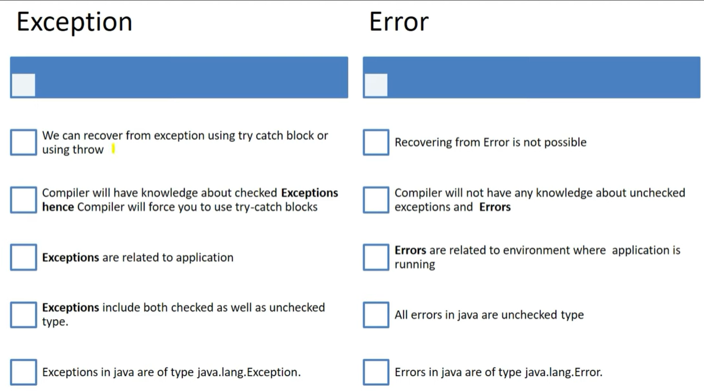

# Exception Handling via Code Decode
# 1.1 What is an Exception?

#### An unexpected event that disturb normal flow of the program is called as Exception.
#### Eg of exception:  

# 1.2 How do we handle exceptions in Java?

### try block
- jisme exception aa sakta hia usse try block mein likhte hai
### catch block
- catch block exception ko catch karta
### finally block
- yaha cleanup code likha jata hai.
- clean up code 
    - humne file open kari hai, ya connection open kiya hai...
    - to usse close karna hi honga 
    - chahe exeption aaye ya nhi.. 
### eg

# 1.3 Hierarchy of Exception Handling?

### Most of the time errors are  not caused by our program and this are occurs due to lack of system resources. Error are non recoverables.
    - jaise outOfmemory error aaya to system Admin ko Heap memory badhana honga.
# 1.4 Difference between Exception and Errors?

- U can throw an error also using java.lang.Error.StackOverflowError
# 1.5 Can we write try block without catch and finally block?

### Question - yadi aapne try block likh kar code run kiya tab kya honga?

- compile time error aavenga ki insert finally to complete try statement.
# 1.6 Can we write other statements between try catch or finally block?

# 1.7 Does remaining statements in try block executes after exception occurs?

- try me exception aaya to catch mein javenga ya aapne thorws kiya ho to waha javenga..aur pgm terminate honga..
# 1.8 Diff bet throw and throws keyword in java?

# 1.9 What happen when an Exception is thrown by the main method?

- main() mehtod mein hi execption aaya to Java runtime Jre ye responsibility leti hai usko handle karni ki.
- since uske pass handling code nhi hai.. 
    - to wo pgm terminate karti
    - aur pura execption print kar deti along with it stack trace.

## by Durga
### Concept of Runtime Stack Mechanism
```java
package com.adi.Excpetions;

public class Test {

	public static void main(String args[]) {

		doStuff();
	}

	public static void doStuff() {

		doMoreStuff();
	}

	public static void doMoreStuff() {
		
		System.out.println("Hello");
	}
}
Output:
Hello
```


1. For Every thread Jvm will create a runtime stack.
2. Each and every method call performed by that thread will be stored in the corresponding stack.
3. Each entry in stack is called stack frame/Activation record.
4. After completing every method call the corresponding entry from the stack will be removed.
5. After completing all method calls the stack will become and empty.
6. And that empty stack will be destroyed by the Jvm just before terminiting the thread.

### Concept of Default Exception Handling in java
```java
package com.adi.Excpetions;

public class Test {

	public static void main(String args[]) {

		doStuff();
	}

	public static void doStuff() {

		doMoreStuff();
	}

	public static void doMoreStuff() {
		
		System.out.println(10/0);
	}
}
Output:
Exception in thread "main" java.lang.ArithmeticException: / by zero  
	at PracDemo/com.adi.Excpetions.Test.doMoreStuff(Test.java:17)
	at PracDemo/com.adi.Excpetions.Test.doStuff(Test.java:12)
	at PracDemo/com.adi.Excpetions.Test.main(Test.java:7)

```
1. Inside a method,  if any execption occurs then the method in which the exception arise is responsible to create exception object by including following information.
    - a) Name of Exception
    - b) Description of Exception
    - c) Location at which exception occurs i.e stack trace.
2. After creating the exception object, method handover it to the Jvm.
3. Jvm will check whether the method contain any execption handling code or not. 
	- If method doesn't contain exception handling code then JVM terminates that method abnormally & removes the corresponding entry from the stack
4) Then JVM identifies caller method and check whether the caller method contain any Exception Handling code or not.
	- If caller  method doesn't contain Exception handling code then JVM terminates the caller method abnormally and removes their corresponding entry from the stack.
5) This process will be continued until main() method.
	- If the main() method also dosen't contain exception handling code then Jvm terminates main() method abnormally and removes corresponding entry from the stack.
6) Then Jvm handover's responsibility of Exception handling to default exception handler which is a part of Jvm.
7) The default exception handler prints the exception information in the following format & terminates program abnormally.

Exception in thread 'XXX': Name of Exception : Description i.e it entire Stack trace.
# 1.10 What do you understand by unreachable catch block error.

# 1.11 What is multi catch block?

# 1.12 What is diff bet final, finally and finalize in Java?

### Just before destroying an object the garbage collectors  always calls the finalize() method to perform clean up activities on that object.
### Note: 
The Garbage collector calls the finalize() method only once on any object.
### Syntax:  
protected void finalize throws Throwable{}
- Since the Object class contains the finalize method hence finalize method is available for every java class.
 - Garbage Collector can call the finalize() method on any java object.


    